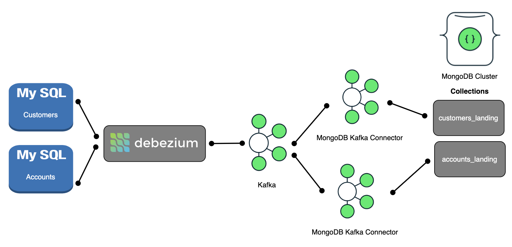
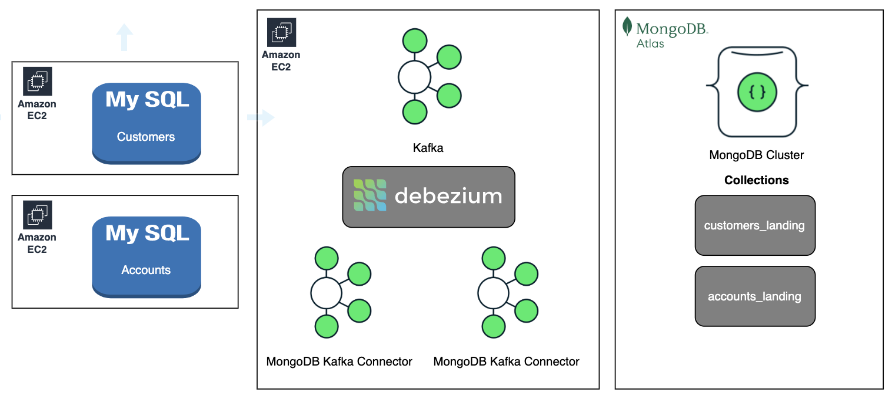

# MongoDB ODL demo with CDC (Change Data Capture)

This repository will allow you to demonstrate how you can leverage MongoDB as an ODL (Operational data layer) and keep the ODL in-sync with two MySQL databases using CDC (Change Data Capture)

## Components

- Two MySQL instances
  - Customers_DB
  - Accounts_DB
- Kafka cluster with Kafka Connect
- Debezium for capturing changes in MySQL
- MongoDB Kafka Sink Connector



## Infrastructure

- The two MySQL instances are going to run in their own respective EC2 instance.
- Kafka, zookeeper, Kafka Connect with MongoDB Sink Connector and Debezium is going to run in a single EC2 instance.
- MongoDB cluster is going to be hosted in Atlas
  

## Setup

### MySQL

#### Configuration EC2

In the folder [mysql](./mysql/) edit [deploy-mysql-ec2](./mysql/deploy-mysql-ec2.tf). Complete the section:

```yaml
key_name = "<your name>"
vpc_security_group_ids = ["<your securitygroup>"]
tags = {
Name = "mysql",
owner = "<your name>",
expires-on = "<expires-on>",
purpose = "<your purpose>"
}
```

The security group needs to allow inbound traffic on:
TCP 3306

---

#### Deploy EC2

In the MySQL folder run:

```bash
terraform init
```

and then

```bash
terraform apply
```

## This will create two EC2 instances running MySQL

#### Configure MySQL

##### Setup databases

In the file [create db.bash](./mysql/creat%20db.bash) you will find some SQL commands to create databases and tables for customers and accounts.

##### Load data

Edit the file [fake_customerdata.py](./mysql/fake_customerdata.py) and use it to create fake data. The script will create a customer in the customers table and between 1 and 3 accounts for that customer in the accounts table. customer_id is the key between the tables.

---

### Kafka and Debezium

This demo uses Docker compose to deploy a set of containers:

- zookeeper
- kafka
- kafka connect
- Kafka-ui
- Debezium-ui

reference the file [docker-compose.yaml](./Change-Data-Capture/public/docker-compose.yaml) for more detailed information.

This file is hosted in this repo: https://github.com/voxic/cdc_public/blob/main/docker-compose.yaml, and being used by the user-data script when deploying EC2 instance.

#### Steps

1. Configuration EC2

In the folder [Change-Data-Capture](./Change-Data-Capture/) edit [deploy-ec2](./Change-Data-Capture/deploy-ec2.tf). Complete the section:

```yaml
key_name = "<your name>"
vpc_security_group_ids = ["<your securitygroup>"]
tags = {
Name = "cdc",
owner = "<your name>",
expires-on = "<expires-on>",
purpose = "<your purpose>"
}
```

The security group needs to allow inbound traffic on:  
TCP 8083 debezium  
TCP 8081 schema-registry  
TCP 9092 Kafka  
TCP 8080 kafka-ui  
TCP 8082 debezium-ui

2. Configure Debezium

Edit the file [accounts_debezium.json](./Change-Data-Capture/accounts_debezium.json)
Add the hostname of the EC2 instance running the accounts DB MySQL

```json
"database.hostname": "<hostname to accounts_db>"
```

Edit the file [customer_debezium.json](./Change-Data-Capture/customer_debezium.json)
Add the hostname of the EC2 instance running the customer DB MySQL

```json
"database.hostname": "<hostname to customer_db>"
```

Edit the file [mongodb_accounts_connector.json](./Change-Data-Capture/mongodb_accounts_connector.json)
Add the connection string for your MongoDB cluster

```json
"connection.uri": "mongodb+srv://<mongodb cluster>"
```

Edit the file [mongodb_customer_connector.json](./Change-Data-Capture/mongodb_customer_connector.json)
Add the connection string for your MongoDB cluster

```json
"connection.uri": "mongodb+srv://<mongodb cluster>"
```

3. Deploy the Debezium configuration

in the file [deploy_connectors.bash](./Change-Data-Capture/deploy_connectors.bash) you will find a few commands to deploy the configuration. Make sure your working directory is in the [Change-Data-Capture](./Change-Data-Capture/) folder before running the commands.

```bash
curl -i -X POST -H "Accept:application/json" -H "Content-Type:application/json" <hostname to vm running debezium>:8083/connectors/ --data @customer_debezium.json
curl -i -X POST -H "Accept:application/json" -H "Content-Type:application/json" <hostname to vm running debezium>:8083/connectors/ --data @accounts_debezium.json
curl -i -X POST -H "Accept:application/json" -H "Content-Type:application/json" <hostname to vm running debezium>:8083/connectors/ --data @mongodb_customer_connector.json
curl -i -X POST -H "Accept:application/json" -H "Content-Type:application/json" <hostname to vm running debezium>:8083/connectors/ --data @mongodb_accounts_connector.json
```

## Running

Once the Debezium configuration is done, Debezium will start watching for changes in the MySQL tables. Use the [fake_customerdata.py](./mysql/fake_customerdata.py) script to add more customers and account. These will then be written to Kafka and written to MongoDB. Once in MongoDB you can use MongoDB Compass to work with the data.  
In the folder [ChangeStream](./Change-Data-Capture/ChangeStreams/) there are a few examples of how to leverage MongoDB change stream to transform incoming data in real-time.
